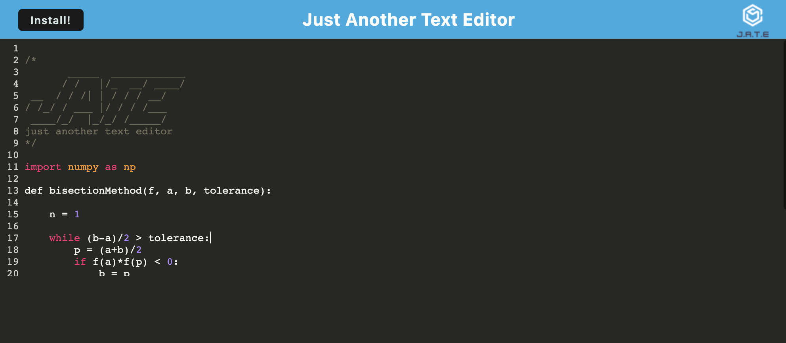

# J.A.T.E. (Just Another Text Editor)

## Description
JATE is an online text editor for coders. It allows the user to install the application to their desktop or use it on the web. It saves input from the user each time the page is out of focus so there is no need to worry about losing your text or code. The application was created with NodeJS, WebPack, and Express Handlebars.

Link: https://winter-jate-text-editor.herokuapp.com/

## Screenshot

